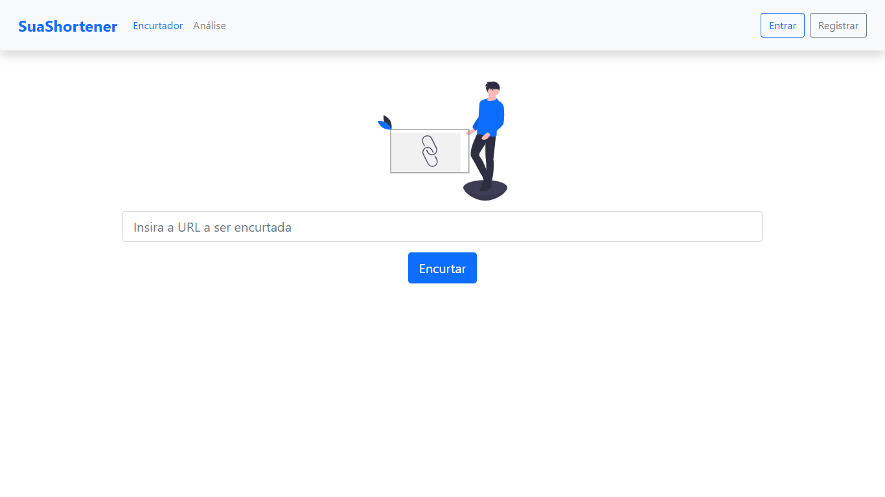

<h1 align="center">
    
    <br/>SuaShortener
</h1>

<p align="center">
  <a href="https://www.crisnaldocarvalho.com.br">
    
  </a>

  
</p>

## Descrição:

<p>
Front-end contruído em ReactJS que encurta URLs. É possível utilizar anonimamente ou criando uma conta na aplicação. Anonimamente é possível gerar URLs encurtadas e ter acesso a página de análise que retorna as 100 urls mais acessadas. Com a autenticação é possível visualizar uma nova aba denominada "Minhas Urls" pela qual é possivel ter acesso as urls geradas quando logado e excluí-las da aplicação.
</p>

A aplicação conta com uma pipeline que a publica automaticamente no Firebase Hosting, e pode ser acessada em homologação através da url:
<a href="https://suashotener.web.app/" target="_blank">https://suashotener.web.app/</a>

<p align="center">
    
</p>

## Instalação:

Após clonar o repositório, instale as dependências do projeto com os comandos abaixo via terminal:

```js
cd shortener-url-react
npm install
```

Abra o projeto no seu editor de código na sua preferência, renomeie o arquivo ".env.example" para ".env" e insira a url da api. Para usar a homologação insira: https://suacr.herokuapp.com

É possível rodar o servidor localmente seguindo as instruções apresentadas no reposiório do mesmo: <a href="https://github.com/CrisnaldoSantos/shortener-url-api" target="_blank">https://github.com/CrisnaldoSantos/shortener-url-api</a>

```js
npm start
```

### Tenologias:

- React JS
- Typescript
- React-Bootstrap
- React Hook Form
- Testing Library
- ReduxJSToolkit
- Redux Sagas
- Firebase
